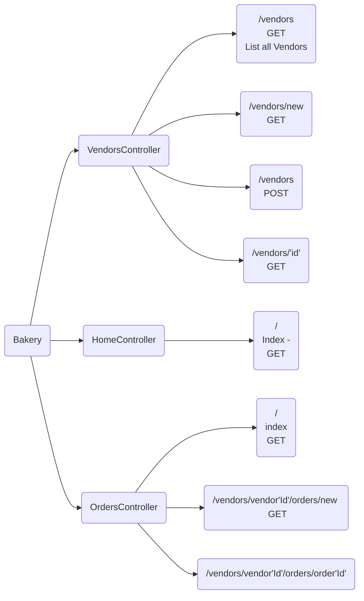

## La Mauvaise Boulangerie

```mermaid
flowchart LR
b-->v(VendorsController)
b(Bakery)-->h(HomeController)
b-->O(OrdersController)
h-->i("/" <br>Index - <br>GET)
v-->v2(/vendors <br> GET <br> List all Vendors)
v-->v3(/vendors/new <br> GET)
v-->v4(/vendors <br> POST)
v-->v5(/vendors/'id'<br> GET)
O-->o1(/ <br> index <br> GET)
O-->o2(/vendors/vendor'Id'/orders/new <br> GET)
O-->o3(/vendors/vendor'Id'/orders/order'Id')


```